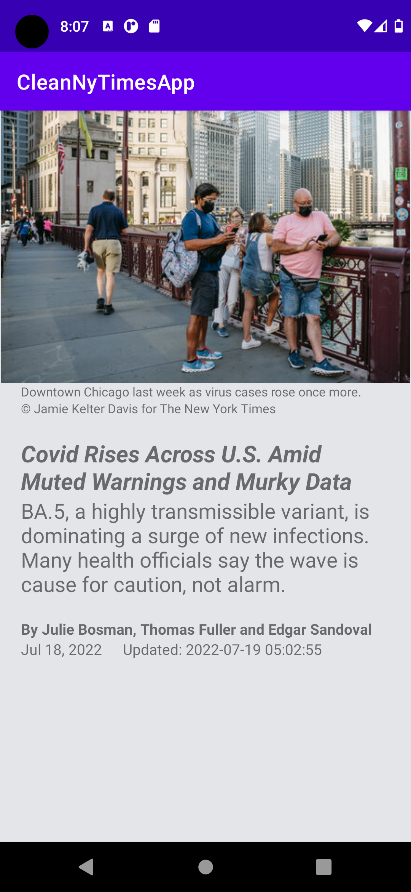

# CleanNyTimesApp

CleanNyTimesApp is a project that downloads most popular articles from RestFul API of [most popular articles - nytimes](https://developer.nytimes.com/docs/most-popular-product/1/overview)

The goal of the project is to combine popular libraries/tools and demonstrate the best development practices by utilizing up to date tech-stack and presenting modern Android application Architecture that is modular, scalable, maintainable, and testable. This application could be useful for providing a base for larger scalable real world projects.

## Project characteristics and tech-stack



This project takes advantage of best practices, many popular libraries and tools in the Android ecosystem. Most of the libraries are in the stable version unless there is a good reason to use non-stable dependency.

* Tech-stack
    * [100% Kotlin](https://kotlinlang.org/) + [Coroutines](https://kotlinlang.org/docs/reference/coroutines-overview.html) - perform background operations
    * [Retrofit](https://square.github.io/retrofit/) - HTTP client
    * [OkHttp](https://square.github.io/okhttp/) - networking
    * [Jetpack](https://developer.android.com/jetpack)
        * [Navigation](https://developer.android.com/topic/libraries/architecture/navigation/) - in-app navigation
        * [LiveData](https://developer.android.com/topic/libraries/architecture/livedata) - data objects that notify views when the underlying database changes.
        * [Flow](https://developer.android.com/kotlin/flow) - flow is a type that can emit multiple values sequentially
        * [Lifecycle](https://developer.android.com/topic/libraries/architecture/lifecycle) - perform an action when lifecycle state changes
        * [ViewModel](https://developer.android.com/topic/libraries/architecture/viewmodel) - store and manage UI-related data in a lifecycle conscious way
        * [Room](https://developer.android.com/jetpack/androidx/releases/room) - SQLite object mapping library
    * [Dependency Injection](https://developer.android.com/training/dependency-injection) -
      - [Hilt-Dagger](https://dagger.dev/hilt/) - Standard library to incorporate Dagger dependency injection into an Android application.
      - [Hilt-ViewModel](https://developer.android.com/training/dependency-injection/hilt-jetpack) - DI for injecting `ViewModel`.
    * [Mavericks](https://airbnb.io/mavericks) - Mavericks is an Android MVI framework from airbnb
    * [Glide](https://bumptech.github.io/glide/) - image loading library
    * [Stetho](http://facebook.github.io/stetho/) - application debugging
    * [Timber](https://github.com/JakeWharton/timber) - a logger with a small, extensible API which provides utility on top of Android's normal Log class
    * [Gson](https://github.com/google/gson) - library that can be used to convert Java Objects into their JSON representation
    * [Turbine](https://github.com/cashapp/turbine) - a nifty little testing library for kotlinx.coroutines [Flow](https://kotlinlang.org/api/kotlinx.coroutines/kotlinx-coroutines-core/kotlinx.coroutines.flow/-flow/)
* Modern Architecture
    * Clean Architecture (domain, data and presentation layers)
    * Single activity architecture using [Navigation component](https://developer.android.com/guide/navigation/navigation-getting-started)
    * MVVM + MVI (presentation layer)
    * [Android Architecture components](https://developer.android.com/topic/libraries/architecture) ([ViewModel](https://developer.android.com/topic/libraries/architecture/viewmodel), [LiveData](https://developer.android.com/topic/libraries/architecture/livedata), [Navigation](https://developer.android.com/jetpack/androidx/releases/navigation))
    * [Android KTX](https://developer.android.com/kotlin/ktx) - Jetpack Kotlin extensions
* Testing
    * [Unit Tests](https://en.wikipedia.org/wiki/Unit_testing) - [JUnit 5](https://junit.org/junit5/) via
      [android-junit5](https://github.com/mannodermaus/android-junit5) and also [Junit4](https://junit.org/junit4/)
    * [UT Tests](https://en.wikipedia.org/wiki/Graphical_user_interface_testing) - [Espresso](https://developer.android.com/training/testing/espresso)
    * [Mockk](https://mockk.io/) - mocking framework
    * [Kluent](https://github.com/MarkusAmshove/Kluent) - assertion framework
    * [Truth](https://truth.dev/) - Fluent assertions for Java and Android
* UI
    * [Material design](https://material.io/design)
    * Reactive UI
* Static analysis tools
    * [Ktlint](https://github.com/pinterest/ktlint) - validate code formatting
    * [Detekt](https://detekt.dev/docs/gettingstarted/gradlegs) - Code smell analysis with complexity reports based on lines of code, cyclomatic complexity and number of code smells
* Gradle
    * [Gradle Kotlin DSL](https://docs.gradle.org/current/userguide/kotlin_dsl.html)
    * Plugins ([SafeArgs](https://developer.android.com/guide/navigation/navigation-pass-data#Safe-args),
      [android-junit5](https://github.com/mannodermaus/android-junit5))
    * [Dependency locks](https://docs.gradle.org/current/userguide/dependency_locking.html)
    * [Versions catalog](https://docs.gradle.org/7.4.2/userguide/platforms.html)

## Architecture

#### Presentation layer

This layer is closest to what the user sees on the screen. The `presentation` layer is a mix of `MVVM` (Jetpack `ViewModel` used to preserve data across activity restart) and
`MVI` (`actions` modify the `common state` of the view and then new state is edited to a view via `LiveData` to be rendered).

> `common state` (for each view) approach derives from
> [Unidirectional Data Flow](https://en.wikipedia.org/wiki/Unidirectional_Data_Flow_(computer_science)) and [Redux
> principles](https://redux.js.org/introduction/three-principles).

Components:
- **View (Fragment)** - presents data on the screen and pass user interactions to View Model. Views are hard to test, so they should be as simple as possible.
- **ViewModel** - dispatches (through `LiveData`) state changes to the view and deals with user interactions (these view models are not simply [POJO classes](https://en.wikipedia.org/wiki/Plain_old_Java_object)).
- **ViewState** - common state for a single view
- **NavManager** - singleton that facilitates handling all navigation events inside `NavHostActivity` (instead of separately, inside each view)

#### Domain layer

This is the core layer of the application. Notice that the `domain` layer is independent of any other layers. This allows to make domain models and business logic independent from other layers.
In other words, changes in other layers will have no effect on `domain` layer eg. changing database (`data` layer) or screen UI (`presentation` layer) ideally will not result in any code change withing `domain` layer.

Components:
- **UseCase** - contains business logic
- **DomainModel** - defines the core structure of the data that will be used within the application. This is the source of truth for application data.
- **Repository interface** - required to keep the `domain` layer independent from the `data layer` ([Dependency inversion](https://en.wikipedia.org/wiki/Dependency_inversion_principle)).

#### Data layer

Manages application data and exposes these data sources as repositories to the `domain` layer. Typical responsibilities of this layer would be to retrieve data from the internet and optionally cache this data locally.

Components:
- **Repository** is exposing data to the `domain` layer. Depending on application structure and quality of the external APIs repository can also merge, filter, and transform the data. The intention of
  these operations is to create high-quality data source for the `domain` layer, not to perform any business logic (`domain` layer `use case` responsibility).

- **Mapper** - maps `entity` to `domain model` (to keep `domain` layer independent from the `data` layer).
- **RetrofitService** - defines a set of API endpoints.
- **DataModel** - defines the structure of the data retrieved from the network and contains annotations, so Retrofit (Gson) understands how to parse this network data (XML, JSON, Binary...) this data into objects.

### Data-Flow


## Dependency management

This project utilizes multiple mechanics to easily share the same versions of dependencies.
### App library dependencies

External dependencies (libraries) are defined using [versions catalog](https://docs.gradle.org/7.0-milestone-1/userguide/platforms.html) feature in the [settings.gradle.kts](./settings.gradle.kts) file. These dynamic library versions are locked using Gradle [locking dependency](https://docs.gradle.org/current/userguide/dependency_locking.html) mechanism - concrete dependency versions are stored in `MODULE_NAME/gradle.lockfile` files.

To update lock files run `./gradlew test lint s --write-locks` command and commit updated `gradle.lockfile` files to
repository.

### Gradle plugin dependencies

Gradle plugins are defined in [pluginManagement](https://docs.gradle.org/current/userguide/plugins.html#sec:plugin_management) block ([settings.gradle.kts](./settings.gradle.kts) file).

Dynamic versions aren't supported for Gradle plugins, so [locking dependency](https://docs.gradle.org/current/userguide/dependency_locking.html) mechanism can't be used (like for app library dependencies), and thus versions of some libraries & plugins have to be hardcoded in the [gradle.properties](./gradle.properties) file.

There is no easy way to share id between `pluginManagement` block and `buildSrc` folder, so plugin ids (also used within build scripts), have to be duplicated in the [GradlePluginId](./buildSrc/java/GradlePluginId/kt) file.

## Design decisions

Read related articles to have a better understanding of underlying design decisions and various trade-offs.

* [Multiple ways of defining Clean Architecture layers](https://proandroiddev.com/multiple-ways-of-defining-clean-architecture-layers-bbb70afa5d4a)
* Using Hilt with MVI library [Mavericks Hilt support](https://airbnb.io/mavericks/#/dagger?id=hilt)
* [Unit Testing Kotlin Flow](https://medium.com/google-developer-experts/unit-testing-kotlin-flow-76ea5f4282c5) using Turbine
* More coming soon

## Getting started

There are a few ways to open this project.

### Android Studio

1. `Android Studio` -> `File` -> `New` -> `From Version control` -> `Git`
2. Enter `https://github.com/roymithun/CleanNyTimesApp.git` into URL field an press `Clone` button

### Command-line + Android Studio

1. Run `git clone https://github.com/roymithun/CleanNyTimesApp.git` command to clone project
2. Open `Android Studio` and select `File | Open...` from the menu. Select cloned directory and press `Open` button

### Code Coverage for Unit Tests

Code coverage of java and kotlin files can measured using Jacoco scripts. Currently, [:presentation](/presentation) and [:data](/data) modules have jacoco gradle configured. To run code coverage, following command can be run on terminal

```
./gradlew fullCoverageReport
```

The generated report can be found at

```
<your system name>/<your project location>/app/build/coverage-report/index.html
```

### Code format validation

Use following command on terminal to run ktlint rules
```
./gradlew ktlintCheck
```

## Known issues
- `ktlint` fails with Wildcard import (cannot be auto-corrected). To disable follow https://stackoverflow.com/a/73199125/2694480
- JUnit 5 does not support tests with suspended modifier ([Issue 1914](https://github.com/junit-team/junit5/issues/1914))
- Gradle dependencies can't be easily shared between app libraries and Gradle plugins https://github.com/gradle/gradle/issues/16077

## How to consume NyTimes API?
Most Popular API from [nytimes developer](https://developer.nytimes.com/apis) have been used.

For example: https://api.nytimes.com/svc/mostpopular/v2/mostviewed/all-sections/7.json?api-key=yourkey

Where your_key has to be generated following [get-started](https://developer.nytimes.com/get-started) page from nytimes.

Once you have yourkey, please add a new entry in ***local.properties*** inside your project directory. Since local.properties is added in [.gitignore](https://github.com/roymithun/NyTimesArticleApp/blob/master/.gitignore). it is never added to VCS. This way your appKey can be kept somehow secured.
- **appKey = your_key**